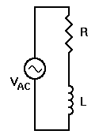
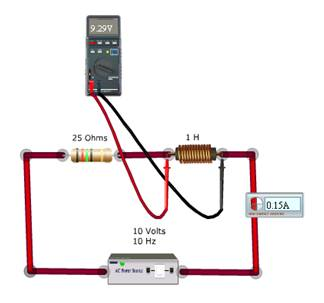

## Theory 

  

 

  When we apply an AC voltage to a series RL circuit as shown below, the circuit behaves in some ways the same as the series RC circuit, and in some ways as a sort of mirror image. For example, current is still the same everywhere in this series circuit. <code>VR</code> is still in phase with <code>I</code>, and <code>VL</code> is still 90&deg; out of phase with <code>I</code>. However, this time <code>VL</code> leads <code>I</code> — it is at +90&deg; instead of -90&deg;.

  For this circuit, we will assign experimental values as follows: <code>R = 25 &Omega;</code>, <code>L = 1 H</code> and <code>VAC = 10 V_{rms}</code>. We build the circuit and measure 9.29 V across <code>L</code>, and 3.7 V across <code>R</code>. As we might have expected, this exceeds the source voltage by a substantial amount and the phase shift is the reason for it.

  The vectors for this example circuit are shown to the right. This time the composite phase angle is positive instead of negative, because <code>VL</code> leads <code>IL</code>. But to determine just what that phase angle is, we must start by determining <code>XL</code> and then calculating the rest of the circuit parameters.

$$X_L = 2\pi fL= 6.28 \times 10 \times 1= 62.8$$
$$Z = 25 + j62.8\Omega= (25^2 + 62.8^2)^{1/2}= (625 + 3943.84)^{1/2}$$
$$= (4568.84)^{1/2}= 67.59\Omega=\frac{E}{Z}$$

$$\frac{E}{Z}= \frac{10}{67.59}$$
$$= 0.14795\mathrm{A}$$
$$= 0.15\mathrm{A}$$
$$V_R = I \times R$$
$$= 0.14795 \times 25$$
$$= 3.7\mathrm{V}$$

$$V_L = I \times X_L= 0.14795 \times 62.8= 9.29\mathrm{V}$$
$$\phi = \arctan \left( X_L / R \right) = \arctan \left( 62.8 / 25 \right)= \arctan \left( 2.512 \right)= 68.29^\circ$$

This can be easily verified using the simulator, by creating the above mentioned circuit and measuring the current and voltages across the resistor and inductor.

### Applicatios
 

These circuits exhibit important types of behaviour so they are fundamental to analogue electronics.  It has  wide applications in Electronic filter topology and Piezo electric shunt damping system.

